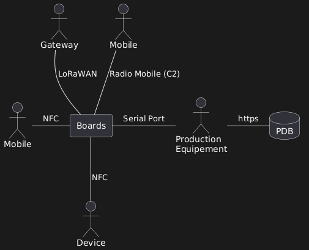
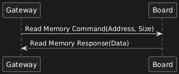

# Software Requirements Specification (SRS)

## 0. Introduction

### 0.1 Purpose & Scope

This document defines the firmware requirements for the system firmware **<<System firmware Reference>>**, which is used in the device **<<Device Reference>>**.

It is intended primarily for firmware engineers to define the **architecture** and **expected behavior** of the firmware system.  

Additionally, this document serves as the **authoritative source of requirements** against which the firmware will be verified and validated.

### 0.2 Responsibilities

The **firmware development team** is responsible for the creation, maintenance, and version control of this document.

All other project team members — whether internal or external — are designated as **readers**.  

They may propose modifications through the defined change control process.

### 0.3 References

List of documents referenced in this specification:

| Name                                  | Reference                         |
|-------------------------------------  |-----------------------------------|
|  Systeme Architecture Design          | [REF-SAD](https://git-scm.com/)  |
|  LoRaWAN® Certification Protocol      | [TS001-1.0.4 LoRaWAN® L2 1.0.4 Specification](https://git-scm.com/)  |

## 1. Architecture Snapshot

> Overview of the sub-system impacted by this documentation.  
> Reference the system architecture document using the same denomination.  
> Example: [REF: ARCH-XXX-DOC-0001]
 
  **[REF-FRS-ARCH-0001]** Requirement Short Name  
  

## 2. Functional Requirements
---
List of functional requirements associated with this feature/module.  

 **[REF-FRS-FUN-0001]** Requirement Short Name  
 _Description of functional requirement_  
 [REF HFN-XXX-DIE-000X] [STATUS ACTIVE] [REV XX]

## 3. Operational Requirements

### 3.1 Interaction

- Description of alarm, warning, and operator message sequences driven by the software system.
- Description of user actions and system responses.

**[REF-FRS-INT-0002] Requirement Short Name**

  _Description of Interaction for a functional requirement_ 

[REF REF-SAD-XXXX] [STATUS ACTIVE] [REV 02]

**[REF-FRS-INT-0002] Requirement Short Name**

  _Description of functional requirement_ 

[REF REF-SAD-XXXX] [STATUS ACTIVE] [REV 02]

### 3.2 Interfaces

Describe the links between the software system and other systems (e.g., hardware, external software, sensors).

 **[REF-FRS-INTF-0001]** Requirement Short Name  
  _Description of Interface use by a functional requirement_  
  > e.g The Firmware shall communication with the IZAR Mobile over the NFC interfaces 
  [REF TBD] [STATUS ACTIVE] [REV XX]

### 3.3 Inputs/Outputs

> If requirements are simple and I/Os are limited, this section can be merged into **Interfaces**.

 > _Description of Input/Output Data use by a Interfaces & Interaction requirement_ 
 
| Name       | Description                          | Characteristics          | Min          | Default | Max           |
|------------|--------------------------------------|--------------------------|--------------|---------|---------------|
| Temperature| Temperature sensor reading           | Analog, sampled @10Hz    | -40°C        | 25°C    | 125°C         |
| Address    | RAM Memory address                   | Digital 32-bits          | 0x5000_0000  | N/A     | 0x8000_0000   |
| Size       | Number of Byte                       | Digital 32-bits          | 0            | N/A     | UINT32_MAX    |
--- 

## 4. System Attributes / Quality of Service

### 4.1 Performance Requirements

> State performance expectations like latency, throughput, timing, etc.

[REF-FRS-PERF-0002] Requirement Short Name

The software shall respond to user input within `X ms`.
 [REF HFN-XXX-DIE-000X] [STATUS ACTIVE] [REV XX]
### 4.2 Safety Requirements

> Risk Control Measures not included in feature-specific requirements.

- Example: Triple redundancy for safety-critical parameters.

 **[REF-FRS-SFT-0001]** Requirement Short Name  
  _Description of functional requirement_  
  [REF HFN-XXX-DIE-000X] [STATUS ACTIVE] [REV XX]

### 4.3 Security Requirements

- Authentication and Authorization
- Audit Trail
- Data protection and secure communication

 **[REF-FRS-SECU-0001]** Requirement Short Name  
  _Description of functional requirement_  
  [REF HFN-XXX-DIE-000X] [STATUS ACTIVE] [REV XX]

### 4.4 Maintainability Requirements

- Modularity for component-level updates and unit testing

 **[REF-FRS-MTN-0001]** Requirement Short Name  
  _Description of functional requirement_  
  [REF HFN-XXX-DIE-000X] [STATUS ACTIVE] [REV XX]

### 4.5 Portability Requirements

- OS/Toolchain/language independence
- Example: Code must compile on STM32 and Linux simulation environments

 **[REF-FRS-POR-0001]** Requirement Short Name  
  _Description of functional requirement_  
  [REF HFN-XXX-DIE-000X] [STATUS ACTIVE] [REV XX]

### 4.6 Testability Requirements

This section outlines the requirements for ensuring that the software system can be adequately tested throughout its lifecycle.

[REF-FRS-TST-0001] Shell 

The firmware shall include a **shell** for integration testing, allowing testers to interact with individual components or modules without needing to run the entire system. 

[REF N/A]  [STATUS ACTIVE] [REV 02]

**[REF-FRS-TST-0002] Shell - CLI**

The shell shall provide **command-line interface (CLI)** commands to initialize and configure modules for testing.

[REF N/A]  [STATUS ACTIVE] [REV 02]

**[REF-FRS-TST-0002] Shell - Setter/Getter**

The shell shall allow interaction with the firmware by **setting and getting internal states** of the components (e.g., configuration values, operational status).

[REF N/A]  [STATUS ACTIVE] [REV 02]

_[REF-FRS-TST-0002] Shell - Simulate Fault_

The shell shall allow testers to **simulate fault conditions**, such as erroneous data or communication failures, and test the system's response.

[REF N/A]  [STATUS ACTIVE] [REV 02]

_[REF-FRS-TST-0002] Shell - Logging_

The shell shall provide **logging** of interactions and test results for post-test analysis.

[REF N/A]  [STATUS ACTIVE] [REV 02]

_[REF-FRS-TST-0002] Shell - Portabl_

The shell shall be **portable** and compatible with different platforms (e.g., STM32, Raspberry Pi, Linux development environment) to facilitate integration testing on target hardware or during firmware development.

[REF N/A]  [STATUS ACTIVE] [REV 02]

### 4.7 Availability Requirements

This section defines the firmware requirements to ensure system availability, fault recovery, and readiness for operation.

- Automatic recovery mechanisms
- Safe fallback modes

### 4.8 Reliability Requirements

This section outlines the firmware reliability expectations necessary to ensure consistent and dependable system behavior throughout the device’s lifecycle.

> - The firmware shall achieve a **Mean Time Between Failures (MTBF)** of at least **10,000 operating hours** under normal usage conditions.
> - The system shall detect and respond to firmware faults through **watchdog mechanisms**, **error handlers**, and **fail-safe states**.
> - Critical operations shall include **redundancy checks** (e.g., CRCs, checksums) to ensure data and execution integrity.
> - The firmware shall support **graceful degradation**: in case of partial failure, non-critical functions shall be disabled while maintaining essential safety-critical operations.
> - Persistent faults shall be **logged with timestamps and context information** for later analysis and root cause investigation.
> - The firmware shall support **automatic recovery** from transient errors without requiring user intervention.
> - Where applicable, **self-diagnostics** shall be performed at startup and periodically during runtime.

### 4.9 Production Requirements

This section defines the requirements necessary for the firmware to support production, calibration, and final testing activities.

> - The firmware shall support a **production test mode** that enables manufacturing personnel to execute diagnostics without accessing clinical functions.
> - All **calibration routines** shall be executable via a dedicated interface and provide pass/fail results automatically.
> - The system shall support **serial number programming** and configuration of production-specific parameters (e.g., hardware variant flags).
> - Production tools must be able to communicate with the firmware through a **dedicated protocol interface** (e.g., UART, USB, or CAN).
> - The firmware shall include **protection mechanisms** to prevent unauthorized re-entry into production mode after final device sealing or labeling.

---

## 5. Other Non-Functional Requirements

### 5.1 Data Definition and Database Requirements

- Description of data storage, integrity checks, redundancy

_[REF-FRS-NFR-0001] Application Binary - Naming Convention_

The Application Firmware binary shall have this naming convention: REFA-VX.Y.Z-<RevisionID>.hex

[REF N/A]  [STATUS ACTIVE] [REV 02]

_[REF-FRS-NFR-0002] Bootloader Binary - Naming Convention_

The Bootloader Firmware binary shall have this naming convention: REFB-VX.Y.Z-<RevisionID>.hex

[REF N/A]  [STATUS ACTIVE] [REV 02]

_[REF-FRS-NFR-0002] REF Image - Naming Convention_

The REF Image shall have this naming convention: REF-VX.Y.Z.hex

[REF N/A] [STATUS ACTIVE] [REV 02]

### 5.2 User Documentation Requirements

- List required documents (e.g., User Manual, Service Manual)

### 5.3 User Maintenance Requirements

- Installation, acceptance, and maintenance at operation site

### 5.4 Regulatory / Legal Requirements

- Compliance with applicable standards:    
  - IEEE 12207 software life cycle processes 

---
